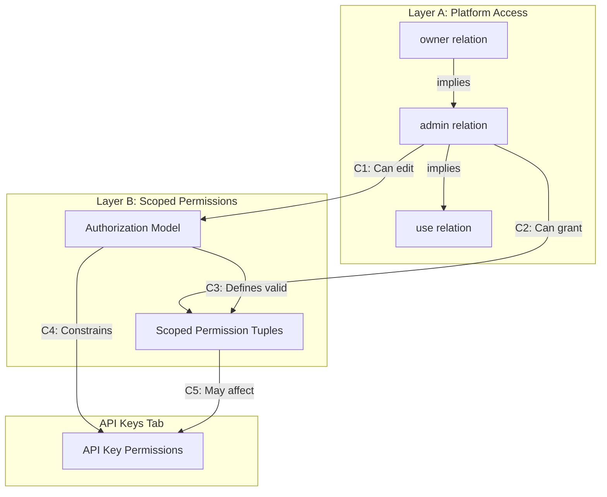

# ReBAC API Integration for Access Control UI

Map the existing mock UI at `src/app/admin/clients/[id]/access` to the ReBAC services and repositories, replacing legacy access control with the tuple-based system.

---

## Cross-Layer Constraints Analysis

> [!IMPORTANT]
> **This is critical**: The two layers (Platform Access + Scoped Permissions) share the same `access_tuples` table. Changes in one layer can impact the other. Below are all identified constraints.

### Layer Definitions

| Layer | Entity Type in Tuples | Purpose | Relations |
|-------|----------------------|---------|-----------|
| **A: Platform Access** | `oauth_client` | Controls WHO can manage/use a client | `use`, `admin`, `owner` |
| **B: Scoped Permissions** | `client_{clientId}` | Controls WHAT a user can do within the client app | Custom: `invoices:read`, etc. |

### Constraint Matrix



### Detailed Constraints

#### C1: Platform Admin → Authorization Model Access
- **Rule**: Only `admin` or `owner` of a client can modify its Authorization Model
- **Impact**: UI must check platform access before allowing model edits
- **Implementation**: Server action `updateAuthorizationModel` must verify caller has `admin` relation

#### C2: Platform Admin → Scoped Permission Management
- **Rule**: Only platform `admin`/`owner` can grant scoped permissions to others
- **Impact**: The "Add Permission" button visibility depends on platform access
- **Implementation**: `grantScopedPermission` action must verify caller access

#### C3: Authorization Model → Scoped Permission Validity
- **Rule**: A scoped permission tuple is only valid if the `relation` exists in the model
- **Impact**: If a relation is removed from model, orphan tuples become invalid
- **Implementation**: Already handled by `AuthorizationModelService.checkDependencySafety`

#### C4: Authorization Model → API Key Constraints
- **Rule**: API keys can only be granted permissions defined in the model
- **Impact**: API key creation UI must filter available permissions from model
- **Implementation**: API key creation modal should fetch model and limit options

#### C5: Scoped Permissions → API Key Impact
- **Rule**: Revoking a scoped permission doesn't auto-revoke from API keys (different tuple)
- **Impact**: Need warning when revoking permissions that API keys depend on
- **Implementation**: Extend dependency check to include API key tuples

#### C6: Platform Access Removal → Cascading Effects
- **Rule**: When removing a user's platform access, should their scoped permissions remain?
- **Open Question**: Need to decide behavior:
  - Option A: Auto-revoke scoped permissions (cleaner)
  - Option B: Keep scoped permissions (user might get access back)
- **Recommendation**: Option A with confirmation dialog

#### C7: UI Refresh Synchronization
- **Rule**: Changes in Layer A may invalidate displayed Layer B data
- **Impact**: After granting/revoking platform access, scoped permissions list may need refresh
- **Implementation**: Use `loadData()` pattern to refresh all sections together OR use React Query invalidation

---

### Does Platform Admin Need Scoped Permissions?

> [!NOTE]
> **Answer: No, by design.**

The platform `admin` role is about **managing the client**, not using the client's application:
- **Platform `admin`**: Can configure the client, manage its access list, edit Authorization Model
- **Scoped permissions**: Are for end-users of the application using this client

However, if an admin wants to test the application, they would need explicit scoped permissions. The transitivity should NOT auto-grant app-level permissions.

**Recommendation**: Keep layers separate. An `admin` has full *management* rights but zero *application* rights unless explicitly granted.

---

## Proposed Changes

### Repository Layer

#### [NEW] [authorization-model-repository.ts](file:///home/quanghuy1242/pjs/auther/src/lib/repositories/authorization-model-repository.ts)

Wraps `AuthorizationModelService` to follow repository pattern. The service currently calls DB directly; the repository becomes the public interface for actions.

```typescript
// AuthorizationModelService.ts will be refactored to use TupleRepository singleton
// AuthorizationModelRepository wraps the service and adds:
- findByClientId(clientId: string): Promise<AuthorizationModelDefinition | null>  // Converts to client_{clientId}
- upsert(clientId: string, definition: AuthorizationModelDefinition): Promise<void>
- listForClient(clientId: string): Promise<AuthorizationModelDefinition | null>
- preValidateUpdate(clientId: string, newDef: AuthorizationModelDefinition): Promise<ValidationResult>
```

> [!NOTE]
> **Service Refactor**: `AuthorizationModelService` currently creates its own `TupleRepository` instance (line 10-11). Should be refactored to use the singleton from `repositories/index.ts`.

#### [MODIFY] [tuple-repository.ts](file:///home/quanghuy1242/pjs/auther/src/lib/repositories/tuple-repository.ts)

```typescript
// New methods:
+ findByEntityType(entityType: string): Promise<Tuple[]>
+ createIfNotExists(params: CreateTupleParams): Promise<{ tuple: Tuple; created: boolean }>
+ deleteById(id: string): Promise<boolean>
+ countByEntityAndRelation(entityType: string, entityId: string, relation: string): Promise<number>
```

#### [MODIFY] [index.ts](file:///home/quanghuy1242/pjs/auther/src/lib/repositories/index.ts)

```typescript
+ export const tupleRepository = new TupleRepository();
+ export const authorizationModelRepository = new AuthorizationModelRepository();
```

---

### API Key Exchange Update

#### [MODIFY] [route.ts](file:///home/quanghuy1242/pjs/auther/src/app/api/auth/api-key/exchange/route.ts)

Current flow (lines 86-127):
1. `auth.api.verifyApiKey()` - Better Auth checks key validity
2. Extracts `permissions` from JSON blob in API key record

**ReBAC flow**:
1. `auth.api.verifyApiKey()` - Better Auth checks key validity (no permissions param)
2. Use `PermissionService.checkPermission()` or query tuples for the API key's permissions
3. Sign JWT with tuple-derived permissions

```diff
- const verificationResult = await auth.api.verifyApiKey({
-   body: {
-     key: apiKey,
-     ...(requestedPermissions && { permissions: requestedPermissions }),
-   },
-   headers: await headers(),
- });
+ // Step 1: Verify key validity only
+ const verificationResult = await auth.api.verifyApiKey({
+   body: { key: apiKey },
+   headers: await headers(),
+ });
+
+ // Step 2: Resolve permissions from tuples
+ const apiKeyId = verificationResult.key?.id;
+ const tuples = await tupleRepository.findBySubject("apikey", apiKeyId);
+ const permissions = tuplesToPermissionsMap(tuples);
```

---

### Server Actions (New)

#### [MODIFY] [actions.ts](file:///home/quanghuy1242/pjs/auther/src/app/admin/clients/%5Bid%5D/access/actions.ts)

| Action | Constraint Checks | Uses |
|--------|-------------------|------|
| `getPlatformAccessList(clientId)` | None | `tupleRepository.findByEntity("oauth_client", clientId)` |
| `grantPlatformAccess(...)` | Caller must be admin (C2) | `tupleRepository.createIfNotExists(...)` |
| `revokePlatformAccess(...)` | Warn if has scoped perms (C6) | `tupleRepository.delete(...)` |
| `getAuthorizationModel(clientId)` | Caller must have `use` | `authorizationModelRepository.findByClientId(...)` |
| `updateAuthorizationModel(...)` | Caller must be `admin` (C1), Dependency check (C3) | `authorizationModelRepository.upsert(...)` |
| `getScopedPermissions(clientId)` | Model must exist | `tupleRepository.findByEntityType("client_{clientId}")` |
| `grantScopedPermission(...)` | Caller `admin` (C2), Relation in model (C3) | `tupleRepository.create(...)` |
| `revokeScopedPermission(...)` | Check API key deps (C5) | `tupleRepository.deleteById(...)` |

---

### Legacy Code Removal

> [!CAUTION]
> **Deprecated Tables**: The following tables/repositories are NO LONGER IN USE and should be removed as part of this migration:
> - `user_client_access` table + `userClientAccessRepository`
> - `group_client_access` table (if exists)
> - `oauthClientMetadata.allowedResources` field (replaced by Authorization Model)

| File | Action |
|------|--------|
| `userClientAccessRepository` | **DELETE** - Replace with `tupleRepository` |
| `access/actions.ts` - old functions | **DELETE** - `assignUserToClient`, `removeUserFromClient`, `updateUserAccess`, `getClientUsers` |
| `oauthClientMetadata.allowedResources` | **DELETE** - Migrate to Authorization Model |
| `src/app/admin/clients/[id]/access/access-control-client.tsx` | **DELETE** - Replaced by `src/components/admin/access-control/access-control.tsx` |

---

## UI Component Updates

### State Refresh Strategy

```typescript
// Single loadData function refreshes ALL layers together
const loadData = async () => {
  const [platformAccess, authModel, scopedPerms, apiKeys] = await Promise.all([
    getPlatformAccessList(client.clientId),
    getAuthorizationModel(client.clientId),
    getScopedPermissions(client.clientId),
    getClientApiKeys(client.clientId),  // If API keys tab exists
  ]);
  // Update all states atomically
};

// After ANY mutation, call loadData() to ensure UI consistency
```

### Component Constraint Enforcement

| UI Element | Constraint Check | Disabled When |
|------------|------------------|---------------|
| Edit Model Button | C1 | User is not platform `admin` |
| Add Permission Button | C2 | User is not platform `admin` |
| Remove Relation Button | C3 | Tuples exist with that relation |
| Revoke Permission | C5 | Show warning if API keys depend on it |
| Remove User Access | C6 | Show confirmation if has scoped perms |

---

### Data Model Editor Fixes


> [!NOTE]
> **Correction**: The database schema (`rebac-schema.ts`) explicitly supports `entityType` in the `authorization_models` table. The original assumption that the schema was flat was incorrect. The data model editor supports defining multiple entity types (e.g., `invoice`, `report`) as per the database design. We should look at the DB schema instead of the inner Zod schema which was incomplete.

**Problem 1: Missing Permissions Builder**

The current editor (as restored) allows defining **Entity Types** and their **Relations** (e.g., `invoice` has `viewer`), but it completely lacks a way to define **Permissions** (e.g., `read`, `write`) and link them to those relations.

A complete ReBAC model requires both:
1. **Relations**: Who is related to the object? (e.g., `viewer`)
2. **Permissions**: What can they do? (e.g., `read` if `viewer`)

**Required Changes:**

1. **Keep Entity Types Sidebar**: The sidebar for selecting `user`, `group`, `invoice` is correct and should be kept.
2. **Add Permissions Panel**: Inside each entity view, alongside "Relations", we need a "Permissions" section to define actions like `read`, `write` and map them to relations (e.g., `read` -> `viewer`).
3. **Update Schema**: Ensure the schema supports `types.{type}.permissions`.

**New UI Structure:**
```
┌─────────────────────────────────────────────────────────┐
│ Entity: invoice                                          │
├───────────────────────────┬─────────────────────────────┤
│ RELATIONS                 │ PERMISSIONS                 │
│ ┌───────────────────────┐ │ ┌─────────────────────────┐ │
│ │ owner    → []         │ │ │ read   → viewer         │ │
│ │ editor   → [owner]    │ │ │ write  → editor         │ │
│ │ viewer   → [editor]   │ │ │ delete → owner          │ │
│ └───────────────────────┘ │ └─────────────────────────┘ │
└───────────────────────────┴─────────────────────────────┘
```

---

## Verification

Build check with `pnpm run local:build` to ensure no type errors.

**Manual Verification Flows**:
1. Grant platform access → verify tuple created
2. Grant scoped permission → verify relation exists in model first
3. Remove relation from model with active tuples → verify rejection
4. Revoke platform access for user with scoped perms → verify cascade behavior
5. API key exchange → verify permissions resolved from tuples not JSON
