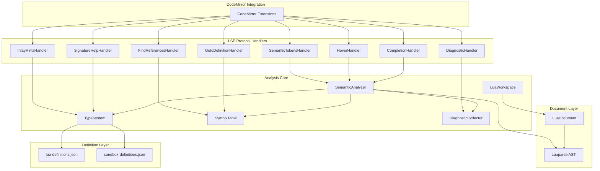

# Lua Language Server Architecture for Pipeline Editor

## Overview

Refactor the Lua editor extensions from hardcoded definitions to a proper **LSP-inspired architecture** with:
1. **Static analysis** for sandbox builtins (`helpers.*`, `context.*`) via JSON definitions
2. **Semantic analysis** for user code with proper scope tracking, type inference, and document model
3. **Standard LSP protocol types** for cross-feature consistency
4. **Decoupled architecture** allowing independent feature development

> [!IMPORTANT]
> This is a major refactoring effort. The new architecture draws inspiration from EmmyLua Analyzer but is implemented in TypeScript for CodeMirror integration. No code will be copied from the old `lua-extensions` folder.

---

## 🏗️ Proposed Architecture



---

## User Review Required

> [!WARNING]
> **Breaking Change**: The new architecture is not backward compatible with the old `lua-extensions`. Migration will require updating imports and configuration in `ScriptEditorModal`.

> [!IMPORTANT]
> **Design Decision: Runtime vs LSP Server**
> We're implementing this as an in-browser "mini LSP" rather than a full LSP server. This keeps the implementation simpler and avoids WebSocket/Worker complexity for now. The architecture is designed to allow future extraction to a real LSP server if needed.

---

## Proposed Changes

### Core Types & Protocol

#### [NEW] [protocol.ts](file:///home/quanghuy1242/pjs/auther/src/components/admin/pipelines/editor-modal/lua-extensions-2/protocol.ts)

LSP-standard types adapted for our use case:

```typescript
// Position & Range (LSP-standard)
interface Position { line: number; character: number; }
interface Range { start: Position; end: Position; }
interface Location { uri: string; range: Range; }

// Completion (LSP CompletionItem)
interface CompletionItem {
  label: string;
  kind: CompletionItemKind;
  detail?: string;
  documentation?: MarkupContent;
  insertText?: string;
  textEdit?: TextEdit;
  additionalTextEdits?: TextEdit[];
  sortText?: string;
  filterText?: string;
  data?: unknown;
}

// Hover (LSP Hover)
interface Hover {
  contents: MarkupContent;
  range?: Range;
}

// Diagnostic (LSP Diagnostic)
interface Diagnostic {
  range: Range;
  severity: DiagnosticSeverity;
  code?: string | number;
  source?: string;
  message: string;
  relatedInformation?: DiagnosticRelatedInformation[];
}

// Signature Help (LSP SignatureHelp)
interface SignatureHelp {
  signatures: SignatureInformation[];
  activeSignature?: number;
  activeParameter?: number;
}

// Semantic Tokens (LSP SemanticTokens)
interface SemanticTokensLegend {
  tokenTypes: string[];
  tokenModifiers: string[];
}

// etc...
```

---

### Definition Layer (Static Analysis)

#### [NEW] [definitions/lua-builtins.json](file:///home/quanghuy1242/pjs/auther/src/components/admin/pipelines/editor-modal/lua-extensions-2/definitions/lua-builtins.json)

Standard Lua library definitions:

```json
{
  "$schema": "./lua-definition-schema.json",
  "version": "5.3",
  "globals": {
    "print": {
      "kind": "function",
      "signature": "print(...)",
      "description": "Receives any number of arguments and prints their values to stdout",
      "params": [{ "name": "...", "type": "any", "vararg": true }],
      "returns": { "type": "nil" }
    },
    "type": {
      "kind": "function",
      "signature": "type(v)",
      "description": "Returns the type of its only argument as a string",
      "params": [{ "name": "v", "type": "any" }],
      "returns": { "type": "string" }
    }
    // ... more globals
  },
  "libraries": {
    "string": {
      "kind": "table",
      "description": "String manipulation library",
      "fields": {
        "len": {
          "kind": "function",
          "signature": "string.len(s)",
          "description": "Returns the length of a string",
          "params": [{ "name": "s", "type": "string" }],
          "returns": { "type": "integer" }
        }
        // ... more string methods
      }
    },
    "table": { /* ... */ },
    "math": { /* ... */ }
  }
}
```

#### [NEW] [definitions/sandbox-definitions.json](file:///home/quanghuy1242/pjs/auther/src/components/admin/pipelines/editor-modal/lua-extensions-2/definitions/sandbox-definitions.json)

Sandbox-specific definitions (extracted from `pipeline-engine.ts`):

```json
{
  "$schema": "./lua-definition-schema.json",
  "sandbox": {
    "helpers": {
      "kind": "table",
      "description": "Pipeline helper functions for sandbox scripts",
      "fields": {
        "log": {
          "kind": "function",
          "signature": "helpers.log(msg)",
          "description": "Logs a message to the pipeline output",
          "params": [{ "name": "msg", "type": "any" }],
          "returns": { "type": "nil" }
        },
        "now": {
          "kind": "function",
          "signature": "helpers.now()",
          "description": "Returns the current timestamp in milliseconds",
          "returns": { "type": "number" }
        },
        "fetch": {
          "kind": "function",
          "signature": "helpers.fetch(url, options?)",
          "description": "Makes an HTTPS request (SSRF-protected)",
          "params": [
            { "name": "url", "type": "string" },
            { "name": "options", "type": "FetchOptions", "optional": true }
          ],
          "returns": { "type": "FetchResponse" },
          "async": true
        },
        "hash": {
          "kind": "function",
          "signature": "helpers.hash(text, algorithm?)",
          "description": "Computes a hash of the input text",
          "params": [
            { "name": "text", "type": "string" },
            { "name": "algorithm", "type": "'sha256' | 'md5'", "optional": true }
          ],
          "returns": { "type": "string" }
        },
        "trace": {
          "kind": "function",
          "signature": "helpers.trace(name, fn) or helpers.trace(name, attributes, fn)",
          "description": "Creates a custom tracing span",
          "overloads": [
            {
              "params": [
                { "name": "name", "type": "string" },
                { "name": "fn", "type": "function" }
              ],
              "returns": { "type": "any" }
            },
            {
              "params": [
                { "name": "name", "type": "string" },
                { "name": "attributes", "type": "table" },
                { "name": "fn", "type": "function" }
              ],
              "returns": { "type": "any" }
            }
          ]
        }
        // ... more helpers
      }
    },
    "context": {
      "kind": "table",
      "description": "Hook context containing event data",
      "fields": {
        "trigger_event": { "kind": "property", "type": "string", "description": "Current hook name" },
        "prev": { "kind": "property", "type": "table | nil", "description": "Data from previous script layer" },
        "outputs": { "kind": "property", "type": "table<string, table>", "description": "Outputs keyed by script ID" }
      },
      "hookVariants": {
        "before_signup": {
          "fields": {
            "email": { "kind": "property", "type": "string" },
            "name": { "kind": "property", "type": "string", "optional": true }
          }
        }
        // ... more hook variants
      }
    },
    "await": {
      "kind": "function",
      "signature": "await(promise)",
      "description": "Awaits an async operation (e.g., helpers.fetch)",
      "params": [{ "name": "promise", "type": "Promise<T>" }],
      "returns": { "type": "T" }
    }
  },
  "disabledGlobals": ["os", "io", "package", "require", "loadfile", "dofile", "loadstring", "load", "rawset", "rawget"],
  "types": {
    "PipelineUser": {
      "kind": "table",
      "fields": {
        "id": { "type": "string" },
        "email": { "type": "string" },
        "name": { "type": "string", "optional": true },
        "emailVerified": { "type": "boolean" },
        "image": { "type": "string", "optional": true },
        "createdAt": { "type": "number" },
        "updatedAt": { "type": "number" }
      }
    },
    "FetchResponse": {
      "kind": "table",
      "fields": {
        "status": { "type": "number" },
        "ok": { "type": "boolean" },
        "body": { "type": "table | string" }
      }
    },
    "FetchOptions": {
      "kind": "table",
      "fields": {
        "method": { "type": "'GET' | 'POST' | 'PUT' | 'DELETE'", "optional": true },
        "headers": { "type": "table<string, string>", "optional": true },
        "body": { "type": "string", "optional": true }
      }
    }
    // ... more custom types
  }
}
```

#### [NEW] [definitions/definition-loader.ts](file:///home/quanghuy1242/pjs/auther/src/components/admin/pipelines/editor-modal/lua-extensions-2/definitions/definition-loader.ts)

Loads and validates JSON definitions at runtime:

```typescript
export interface DefinitionLoader {
  loadBuiltins(): Promise<LuaDefinitions>;
  loadSandbox(hookName?: string): Promise<SandboxDefinitions>;
  getType(typeName: string): TypeDefinition | undefined;
  getGlobal(name: string): GlobalDefinition | undefined;
  isDisabled(name: string): boolean;
}
```

---

### Document & Workspace

#### [NEW] [core/document.ts](file:///home/quanghuy1242/pjs/auther/src/components/admin/pipelines/editor-modal/lua-extensions-2/core/document.ts)

Document abstraction for text and AST:

```typescript
export class LuaDocument {
  readonly uri: string;
  readonly version: number;
  
  private _text: string;
  private _ast: LuaAST | null;
  private _parseError: ParseError | null;
  private _lines: string[];
  
  constructor(uri: string, text: string, version = 0);
  
  getText(): string;
  getLines(): string[];
  getLine(line: number): string;
  getAST(): LuaAST | null;
  getParseError(): ParseError | null;
  
  positionToOffset(pos: Position): number;
  offsetToPosition(offset: number): Position;
  
  update(changes: TextChange[]): LuaDocument;
}
```

#### [NEW] [core/workspace.ts](file:///home/quanghuy1242/pjs/auther/src/components/admin/pipelines/editor-modal/lua-extensions-2/core/workspace.ts)

Multi-document workspace for DAG script awareness:

```typescript
export class LuaWorkspace {
  private documents: Map<string, LuaDocument>;
  private analyzers: Map<string, SemanticAnalyzer>;
  private definitions: DefinitionLoader;
  
  constructor(definitions: DefinitionLoader);
  
  openDocument(uri: string, text: string): LuaDocument;
  updateDocument(uri: string, changes: TextChange[]): LuaDocument;
  closeDocument(uri: string): void;
  
  getDocument(uri: string): LuaDocument | undefined;
  getAnalyzer(uri: string): SemanticAnalyzer | undefined;
  
  // Cross-document features
  getScriptOutputSchema(scriptUri: string): ReturnSchema | undefined;
  setScriptDependencies(uri: string, deps: string[]): void;
}
```

---

### Semantic Analysis

#### [NEW] [analysis/type-system.ts](file:///home/quanghuy1242/pjs/auther/src/components/admin/pipelines/editor-modal/lua-extensions-2/analysis/type-system.ts)

Type representation and operations (inspired by EmmyLua):

```typescript
// Core type kinds
export enum TypeKind {
  Nil = "nil",
  Boolean = "boolean",
  Number = "number", 
  String = "string",
  Table = "table",
  Function = "function",
  Any = "any",
  Unknown = "unknown",
  Union = "union",
  Tuple = "tuple",
  Alias = "alias",
}

export interface LuaType {
  kind: TypeKind;
  name?: string;
}

export interface TableType extends LuaType {
  kind: TypeKind.Table;
  fields: Map<string, LuaType>;
  indexer?: { key: LuaType; value: LuaType };
}

export interface FunctionType extends LuaType {
  kind: TypeKind.Function;
  params: ParameterInfo[];
  returns: LuaType[];
  overloads?: FunctionType[];
}

export interface UnionType extends LuaType {
  kind: TypeKind.Union;
  types: LuaType[];
}

// Type operations
export class TypeSystem {
  constructor(definitions: DefinitionLoader);
  
  createPrimitive(kind: TypeKind): LuaType;
  createTable(fields?: Map<string, LuaType>): TableType;
  createFunction(params: ParameterInfo[], returns: LuaType[]): FunctionType;
  createUnion(types: LuaType[]): UnionType;
  
  isAssignableTo(source: LuaType, target: LuaType): boolean;
  narrowType(type: LuaType, condition: LuaNode): LuaType;
  getFieldType(table: LuaType, field: string): LuaType | undefined;
  
  formatType(type: LuaType, depth?: number): string;
}
```

#### [NEW] [analysis/symbol-table.ts](file:///home/quanghuy1242/pjs/auther/src/components/admin/pipelines/editor-modal/lua-extensions-2/analysis/symbol-table.ts)

Symbol tracking with proper scope handling:

```typescript
export enum SymbolKind {
  Variable = "variable",
  Function = "function",
  Parameter = "parameter",
  Field = "field",
  Global = "global",
}

export interface Symbol {
  name: string;
  kind: SymbolKind;
  type: LuaType;
  definitionRange: Range;
  references: Range[];
  documentation?: string;
  isUpvalue?: boolean;
}

export class Scope {
  readonly parent: Scope | null;
  readonly range: Range;
  private symbols: Map<string, Symbol>;
  private children: Scope[];
  
  constructor(range: Range, parent?: Scope);
  
  define(symbol: Symbol): void;
  lookup(name: string): Symbol | undefined;
  lookupLocal(name: string): Symbol | undefined;
  isUpvalue(name: string): boolean;
  
  collectVisibleSymbols(): Map<string, Symbol>;
  findScopeAt(pos: Position): Scope;
}

export class SymbolTable {
  private rootScope: Scope;
  
  constructor(documentRange: Range);
  
  enterScope(range: Range): Scope;
  exitScope(): void;
  getCurrentScope(): Scope;
  
  define(symbol: Symbol): void;
  lookup(name: string): Symbol | undefined;
  addReference(name: string, range: Range): void;
  
  findDefinition(pos: Position): Location | undefined;
  findReferences(pos: Position): Location[];
}
```

#### [NEW] [analysis/analyzer.ts](file:///home/quanghuy1242/pjs/auther/src/components/admin/pipelines/editor-modal/lua-extensions-2/analysis/analyzer.ts)

Main semantic analyzer (AST visitor):

```typescript
export class SemanticAnalyzer {
  private document: LuaDocument;
  private symbolTable: SymbolTable;
  private typeSystem: TypeSystem;
  private diagnostics: Diagnostic[];
  
  constructor(document: LuaDocument, typeSystem: TypeSystem);
  
  analyze(): AnalysisResult;
  
  // Query APIs for handlers
  getTypeAtPosition(pos: Position): LuaType | undefined;
  getSymbolAtPosition(pos: Position): Symbol | undefined;
  getCompletionContext(pos: Position): CompletionContext;
  getSignatureContext(pos: Position): SignatureContext | undefined;
  
  // Private visitor methods
  private visitChunk(node: ChunkNode): void;
  private visitStatement(node: StatementNode): void;
  private visitExpression(node: ExpressionNode): LuaType;
  private visitLocalStatement(node: LocalStatementNode): void;
  private visitFunctionDeclaration(node: FunctionDeclarationNode): void;
  private visitCallExpression(node: CallExpressionNode): LuaType;
  private visitMemberExpression(node: MemberExpressionNode): LuaType;
  // ... etc
}
```

#### [NEW] [analysis/diagnostics.ts](file:///home/quanghuy1242/pjs/auther/src/components/admin/pipelines/editor-modal/lua-extensions-2/analysis/diagnostics.ts)

Diagnostic collector with codes:

```typescript
export enum DiagnosticCode {
  // Syntax
  SyntaxError = "lua-syntax-error",
  
  // Semantic
  UndefinedVariable = "lua-undefined-var",
  UnusedVariable = "lua-unused-var",
  TypeMismatch = "lua-type-mismatch",
  
  // Sandbox
  DisabledGlobal = "lua-disabled-global",
  ScriptSizeExceeded = "lua-script-size",
  NestedLoopDepth = "lua-nested-loops",
  
  // Return validation
  MissingReturn = "lua-missing-return",
  InvalidReturnShape = "lua-invalid-return",
}

export class DiagnosticCollector {
  private diagnostics: Diagnostic[];
  
  add(range: Range, message: string, severity: DiagnosticSeverity, code: DiagnosticCode): void;
  addError(range: Range, message: string, code: DiagnosticCode): void;
  addWarning(range: Range, message: string, code: DiagnosticCode): void;
  addInfo(range: Range, message: string, code: DiagnosticCode): void;
  
  getDiagnostics(): Diagnostic[];
  clear(): void;
}
```

---

### LSP Handlers

#### [NEW] [handlers/completion.ts](file:///home/quanghuy1242/pjs/auther/src/components/admin/pipelines/editor-modal/lua-extensions-2/handlers/completion.ts)

```typescript
export class CompletionHandler {
  constructor(
    private analyzer: SemanticAnalyzer,
    private definitions: DefinitionLoader
  );
  
  handle(pos: Position): CompletionItem[];
  
  private handlePropertyAccess(context: CompletionContext): CompletionItem[];
  private handleGlobalCompletion(context: CompletionContext): CompletionItem[];
  private handleLocalCompletion(context: CompletionContext): CompletionItem[];
  private handleKeywordCompletion(): CompletionItem[];
  private handleSnippetCompletion(): CompletionItem[];
}
```

#### [NEW] [handlers/hover.ts](file:///home/quanghuy1242/pjs/auther/src/components/admin/pipelines/editor-modal/lua-extensions-2/handlers/hover.ts)

```typescript
export class HoverHandler {
  constructor(
    private analyzer: SemanticAnalyzer,
    private typeSystem: TypeSystem
  );
  
  handle(pos: Position): Hover | null;
  
  private formatSymbolHover(symbol: Symbol): MarkupContent;
  private formatTypeHover(type: LuaType): MarkupContent;
}
```

#### [NEW] [handlers/diagnostics.ts](file:///home/quanghuy1242/pjs/auther/src/components/admin/pipelines/editor-modal/lua-extensions-2/handlers/diagnostics.ts)

```typescript
export class DiagnosticHandler {
  constructor(
    private analyzer: SemanticAnalyzer,
    private options: DiagnosticOptions
  );
  
  handle(): Diagnostic[];
  
  private validateSyntax(): void;
  private validateSemantics(): void;
  private validateSandbox(): void;
  private validateReturnShape(): void;
}
```

*(Similar handlers for goto-definition, find-references, signature-help, semantic-tokens, inlay-hints)*

---

### CodeMirror Integration

#### [NEW] [codemirror/extensions.ts](file:///home/quanghuy1242/pjs/auther/src/components/admin/pipelines/editor-modal/lua-extensions-2/codemirror/extensions.ts)

Main export that wires handlers to CodeMirror:

```typescript
export interface LuaLanguageOptions {
  hookName?: string;
  executionMode?: HookExecutionMode;
  previousScriptCode?: string;
  scriptOutputs?: Map<string, ReturnSchema>;
  
  // Feature toggles
  completion?: boolean;
  linting?: boolean;
  hover?: boolean;
  signatureHelp?: boolean;
  gotoDefinition?: boolean;
  findReferences?: boolean;
  semanticHighlighting?: boolean;
  inlayHints?: boolean;
}

export function createLuaLanguageSupport(options: LuaLanguageOptions = {}): Extension[];
```

#### [NEW] [codemirror/adapters.ts](file:///home/quanghuy1242/pjs/auther/src/components/admin/pipelines/editor-modal/lua-extensions-2/codemirror/adapters.ts)

Adapters to convert between LSP types and CodeMirror types:

```typescript
export function lspPositionToOffset(doc: Text, pos: Position): number;
export function offsetToLspPosition(doc: Text, offset: number): Position;
export function lspRangeToOffsets(doc: Text, range: Range): { from: number; to: number };
export function lspCompletionToCodeMirror(item: CompletionItem): CMCompletion;
export function lspDiagnosticToCodeMirror(diag: Diagnostic): CMDiagnostic;
// ... etc
```

---

## File Structure Summary

```
src/components/admin/pipelines/editor-modal/lua-extensions-2/
├── protocol.ts                    # LSP-standard types
├── index.ts                       # Main exports
├── definitions/
│   ├── lua-builtins.json          # Standard Lua library definitions
│   ├── sandbox-definitions.json   # Pipeline sandbox definitions  
│   ├── lua-definition-schema.json # JSON Schema for validation
│   └── definition-loader.ts       # Runtime loader
├── core/
│   ├── document.ts                # LuaDocument abstraction
│   ├── workspace.ts               # Multi-document workspace
│   └── luaparse-types.ts          # Type declarations for luaparse
├── analysis/
│   ├── type-system.ts             # Type representation & operations
│   ├── symbol-table.ts            # Symbol tracking & scopes
│   ├── analyzer.ts                # Main semantic analyzer
│   └── diagnostics.ts             # Diagnostic codes & collector
├── handlers/
│   ├── completion.ts              # textDocument/completion
│   ├── hover.ts                   # textDocument/hover
│   ├── diagnostics.ts             # textDocument/publishDiagnostics
│   ├── goto-definition.ts         # textDocument/definition
│   ├── find-references.ts         # textDocument/references
│   ├── signature-help.ts          # textDocument/signatureHelp
│   ├── semantic-tokens.ts         # textDocument/semanticTokens
│   └── inlay-hints.ts             # textDocument/inlayHint
└── codemirror/
    ├── extensions.ts              # Main CodeMirror integration
    ├── adapters.ts                # LSP <-> CodeMirror type adapters
    └── styles.ts                  # CSS styles for tooltips, etc.
```

---

## Verification Plan

### Automated Tests

1. **Unit tests for type system**:
   ```bash
   npm test -- --testPathPattern="lua-extensions-2/analysis"
   ```

2. **Integration tests for handlers**:
   ```bash
   npm test -- --testPathPattern="lua-extensions-2/handlers"
   ```

3. **Snapshot tests for JSON definitions**:
   ```bash
   npm test -- --testPathPattern="lua-extensions-2/definitions"
   ```

### Manual Verification

1. **Open Script Editor Modal** and verify:
   - Autocomplete works for `helpers.`, `context.`, and locals
   - Hover shows type information
   - Linting catches syntax errors and undefined variables
   - Go-to-definition works for local functions
   - Signature help shows on function calls

2. **Multi-script DAG testing**:
   - Create pipeline with multiple scripts
   - Verify `context.outputs["scriptId"].*` completions work

3. **Different hook types**:
   - Test `before_signup`, `after_login`, `token_build` hooks
   - Verify context fields are hook-specific

---

## Implementation Phases

### Phase 1: Core Infrastructure
- [ ] `protocol.ts` - LSP types
- [ ] `core/document.ts` - Document abstraction
- [ ] `core/luaparse-types.ts` - Luaparse type declarations
- [ ] `definitions/*.json` - Static definitions
- [ ] `definitions/definition-loader.ts` - Definition loader

### Phase 2: Analysis Engine
- [ ] `analysis/type-system.ts` - Type system
- [ ] `analysis/symbol-table.ts` - Symbol table & scopes
- [ ] `analysis/diagnostics.ts` - Diagnostic collector
- [ ] `analysis/analyzer.ts` - Semantic analyzer

### Phase 3: LSP Handlers
- [ ] `handlers/completion.ts`
- [ ] `handlers/hover.ts`
- [ ] `handlers/diagnostics.ts`
- [ ] `handlers/signature-help.ts`
- [ ] `handlers/goto-definition.ts`
- [ ] `handlers/find-references.ts`
- [ ] `handlers/semantic-tokens.ts`
- [ ] `handlers/inlay-hints.ts`

### Phase 4: CodeMirror Integration
- [ ] `codemirror/adapters.ts`
- [ ] `codemirror/extensions.ts`
- [ ] `codemirror/styles.ts`
- [ ] `index.ts` - Main exports

### Phase 5: Migration & Cleanup
- [ ] Update `ScriptEditorModal` to use new extensions
- [ ] Add tests
- [ ] Remove old `lua-extensions` folder (after verification)
