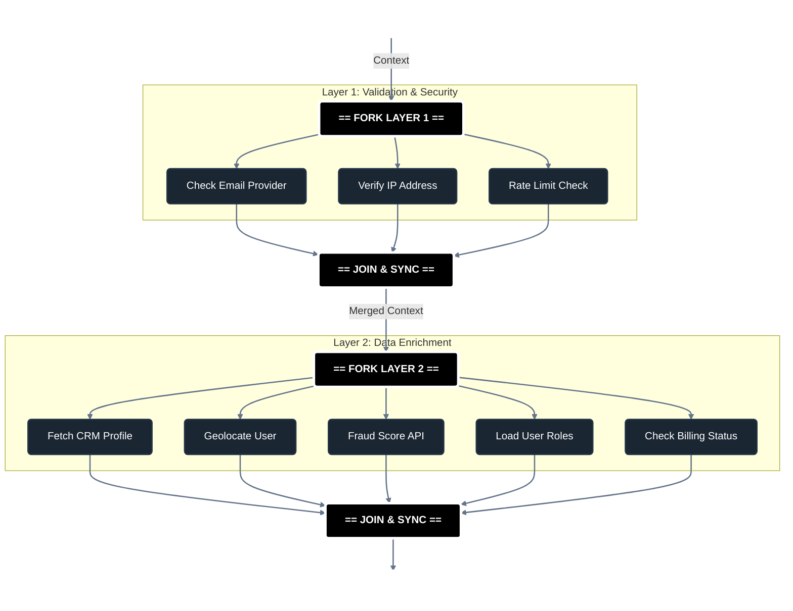

## Design Concept Verification: "Circuit Board" Flow

This section visualizes the implemented **"Fork & Join"** (Circuit Board) pattern for the Swimlane Editor, addressing feedback on nested list layouts.

### The Problem
In complex flows (e.g., 5 layers, 3-5 scripts each), a vertical list obscures the logic. Users can't intuitively "see" that all 5 scripts in Layer 1 must finish before Layer 2 begins.

### The Solution: Visual "Gates"
We use explicit horizontal bars ("Gates") to represent the storage and synchronization points.
- **FORK Lines**: Show data splitting to multiple parallel workers.
- **JOIN Lines**: Show results merging back into a single context.
- **The "Wall"**: The Join bar acts as a visual wall, preventing the eye from jumping ahead prematurely.

#### Visualization

### Key Interactions
1.  **Add Parallel**: Hover over any "FORK" line to see a `(+)` button appear directly on the wire. This creates a new branch.
2.  **Add Sequential**: Click heavily emphasized `(+)` buttons *between* the Join and Fork bars.
3.  **Reflow**: If 5 nodes are too wide, they grid wrap, but their *lines* still connect to the same central Gate, preserving the logical mental model regardless of visual position.
