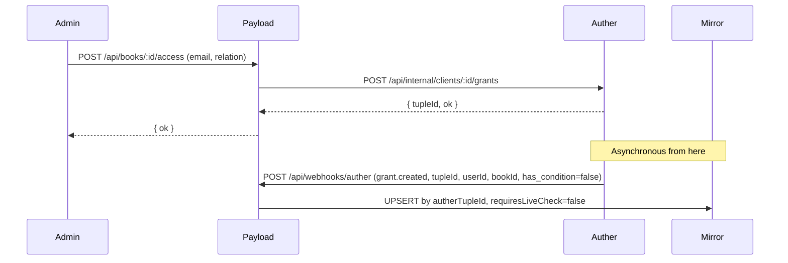
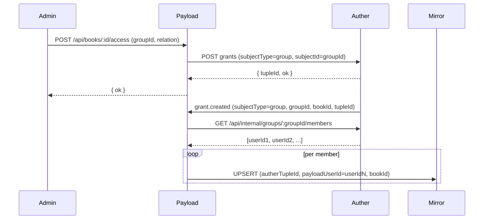
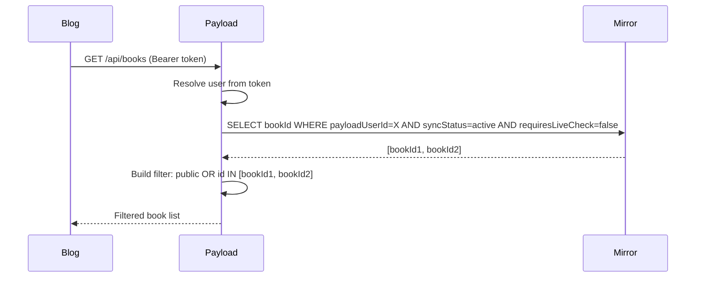
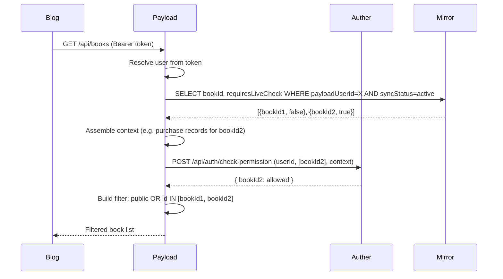
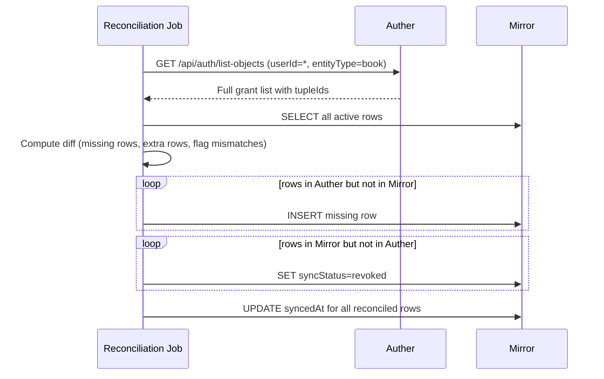

# Authorization Architecture: Detailed Design

> Companion document to `authz-local-projection-plan.md`. This document argues for the revised architecture, explains every data flow in detail, and documents the decisions made about groups, ABAC conditions, and cross-service communication. Code examples are minimal; the focus is on structure and intent.

---

## Table of Contents

1. [Why the Current Setup Is Structurally Misaligned](#1-why-the-current-setup-is-structurally-misaligned)
   - 1.1 [The Check vs ListObjects Distinction](#11-the-check-vs-listobjects-distinction)
   - 1.2 [What a Data Filter Actually Needs](#12-what-a-data-filter-actually-needs)
   - 1.3 [The N+1 as a Symptom, Not the Root Cause](#13-the-n1-as-a-symptom-not-the-root-cause)

2. [Revised Responsibility Map](#2-revised-responsibility-map)
   - 2.1 [Auther — Authority and Evaluation](#21-auther--authority-and-evaluation)
   - 2.2 [PayloadCMS — Read Model and Admin Surface](#22-payloadcms--read-model-and-admin-surface)
   - 2.3 [next-blog — Presentation Only](#23-next-blog--presentation-only)
   - 2.4 [What Crosses the Boundary and What Does Not](#24-what-crosses-the-boundary-and-what-does-not)

3. [The ListObjects API — The Missing Primitive](#3-the-listobjects-api--the-missing-primitive)
   - 3.1 [Why This Must Live in Auther](#31-why-this-must-live-in-auther)
   - 3.2 [What the API Returns](#32-what-the-api-returns)
   - 3.3 [Group Expansion Inside Auther](#33-group-expansion-inside-auther)
   - 3.4 [ABAC Flagging in the Response](#34-abac-flagging-in-the-response)
   - 3.5 [How Payload Consumes This API](#35-how-payload-consumes-this-api)

4. [Group-Based Grants — The Expansion Strategy](#4-group-based-grants--the-expansion-strategy)
   - 4.1 [Why Payload Must Never Expand Groups Itself](#41-why-payload-must-never-expand-groups-itself)
   - 4.2 [Expand at Sync Time, Not at Read Time](#42-expand-at-sync-time-not-at-read-time)
   - 4.3 [Mirror Rows Are Always Resolved to Users](#43-mirror-rows-are-always-resolved-to-users)
   - 4.4 [Handling Group Membership Changes](#44-handling-group-membership-changes)
   - 4.5 [Group Grant Events from Auther](#45-group-grant-events-from-auther)

5. [ABAC and Lua Conditions — The Hybrid Path](#5-abac-and-lua-conditions--the-hybrid-path)
   - 5.1 [What a Conditioned Grant Means](#51-what-a-conditioned-grant-means)
   - 5.2 [Why Payload Cannot Evaluate Lua](#52-why-payload-cannot-evaluate-lua)
   - 5.3 [Why Ignoring Conditions Is Not Acceptable](#53-why-ignoring-conditions-is-not-acceptable)
   - 5.4 [The requiresLiveCheck Flag](#54-the-requireslivecheck-flag)
   - 5.5 [The Purchase-Before-Reading Pattern](#55-the-purchase-before-reading-pattern)
   - 5.6 [Context Injection at Check Time](#56-context-injection-at-check-time)
   - 5.7 [Read Flow with Mixed Grants](#57-read-flow-with-mixed-grants)

6. [The Grant Mirror Collection](#6-the-grant-mirror-collection)
   - 6.1 [Schema Design and Rationale for Every Field](#61-schema-design-and-rationale-for-every-field)
   - 6.2 [Indexing Strategy](#62-indexing-strategy)
   - 6.3 [What Is Not Stored and Why](#63-what-is-not-stored-and-why)
   - 6.4 [Idempotency and Upsert Semantics](#64-idempotency-and-upsert-semantics)

7. [Outbound Webhook Events from Auther](#7-outbound-webhook-events-from-auther)
   - 7.1 [New Event Types Required](#71-new-event-types-required)
   - 7.2 [Event Payload Shape](#72-event-payload-shape)
   - 7.3 [Delivery and Retry Guarantees](#73-delivery-and-retry-guarantees)
   - 7.4 [Idempotency at the Consumer End](#74-idempotency-at-the-consumer-end)

8. [Write Flow — Grant and Revoke](#8-write-flow--grant-and-revoke)
   - 8.1 [Direct User Grant](#81-direct-user-grant)
   - 8.2 [Group Grant](#82-group-grant)
   - 8.3 [Conditioned Grant](#83-conditioned-grant)
   - 8.4 [Revocation](#84-revocation)
   - 8.5 [Why Dual Write Is Forbidden](#85-why-dual-write-is-forbidden)

9. [Read Flow — Local Mirror with Live Fallback](#9-read-flow--local-mirror-with-live-fallback)
   - 9.1 [Anonymous Request](#91-anonymous-request)
   - 9.2 [Authenticated Request — All Unconditional Grants](#92-authenticated-request--all-unconditional-grants)
   - 9.3 [Authenticated Request — With Conditioned Grants](#93-authenticated-request--with-conditioned-grants)
   - 9.4 [Admin Request](#94-admin-request)
   - 9.5 [Chapter Access Derivation](#95-chapter-access-derivation)
   - 9.6 [GraphQL Compatibility](#96-graphql-compatibility)

10. [Reconciliation and Operational Discipline](#10-reconciliation-and-operational-discipline)
    - 10.1 [When the Mirror Diverges](#101-when-the-mirror-diverges)
    - 10.2 [Full Resync via ListObjects](#102-full-resync-via-listobjects)
    - 10.3 [Partial Reconciliation and Resumability](#103-partial-reconciliation-and-resumability)
    - 10.4 [Fail-Closed Default](#104-fail-closed-default)

11. [System Interaction Diagrams](#11-system-interaction-diagrams)
    - 11.1 [Write Flow: Direct User Grant](#111-write-flow-direct-user-grant)
    - 11.2 [Write Flow: Group Grant with Expansion](#112-write-flow-group-grant-with-expansion)
    - 11.3 [Read Flow: Unconditional](#113-read-flow-unconditional)
    - 11.4 [Read Flow: With Conditioned Grants](#114-read-flow-with-conditioned-grants)
    - 11.5 [Reconciliation Flow](#115-reconciliation-flow)

12. [Open Questions and Deferred Decisions](#12-open-questions-and-deferred-decisions)

---

## 1. Why the Current Setup Is Structurally Misaligned

Auther was built as a Check service. Given a single `(subject, permission, entity)` triple, it answers yes or no. This is the right shape for guarding an API endpoint: "can this user call this route?" It is the wrong shape for building a SQL WHERE clause that filters a list of documents down to only the ones a user can see. The current codebase tries to use Check to do filtering by calling it repeatedly, and that mismatch is the root cause of every performance and scalability problem in the read path.

This is not a bug in how Auther was built. It is a recognized gap in authorization system design. OpenFGA names the two operations explicitly: Check and ListObjects. Ory Keto has the same distinction. The gap is common enough that it has a canonical name. The solution is also canonical: add the ListObjects operation to the authorization service.

### 1.1 The Check vs ListObjects Distinction

Check is a point query. Its inputs are a subject (a user or group identifier), a permission name, and an entity identifier. Its output is a single boolean. The evaluation strategy walks from the subject outward through the tuple graph to determine whether a path exists to the specific entity. It is fast for single-entity questions and is exactly what an API gateway or route guard needs.

ListObjects is a graph traversal query. Its inputs are a subject and a permission and an entity type. Its output is a list of all entity identifiers of that type that the subject has the specified permission on. The evaluation strategy is the reverse: it walks from the subject through all reachable tuples, collecting entity IDs as it goes. Group membership, hierarchy, and wildcard tuples all factor in. The result is the complete set of things the subject can act on.

These two operations require different code paths even when they share the same underlying tuple graph. Check can short-circuit as soon as it finds one path to the target entity. ListObjects must complete the full traversal to ensure no reachable entity is missed. Both operations are valid. They serve different callers.

### 1.2 What a Data Filter Actually Needs

Payload's collection access system does not ask "can user X read book 5?" It asks something structurally different: "construct a query constraint that, when applied, returns only the documents this user is allowed to see." The output is a WHERE clause fragment, not a boolean.

For books, the constraint looks like: return all books where visibility is public, or where the book ID is in the set of IDs the user has been granted access to. The second clause requires the set of granted IDs before the query can be constructed. That set is precisely what ListObjects returns.

Without ListObjects, the only alternative is to invert the problem: fetch all private books first, then check each one with Check, then build the set from the results. That inversion is the N+1. It is not a code quality problem that can be fixed with a better data structure. It is the inevitable consequence of using Check where ListObjects is needed.

### 1.3 The N+1 as a Symptom, Not the Root Cause

The current code in `access.ts` pages through all private books in batches, then issues one `checkAutherBookAccess` call per private book that is not owned by the requesting user. The WeakMap cache on the PayloadRequest object ensures this work happens at most once per request, which prevents re-evaluation across nested collection queries within the same request. That cache is a reasonable optimization.

However, the underlying work still scales with the total number of private books, not with the number of books the user can access. If there are 500 private books and a user has access to 3 of them, the system still pages all 500 and issues 500 Check calls to find the 3. The cache does not reduce this cost — it only prevents repeating it within a single request.

Adding a better cache at a higher level (e.g., caching per user across requests) would reduce frequency but not correctness risk. A stale cache of granted book IDs can hold revoked access open past its expiry. The real fix is not a better cache. It is ListObjects, which inverts the traversal direction and makes the cost proportional to what the user can access, not to how many private books exist.

---

## 2. Revised Responsibility Map

The revised architecture keeps each system narrowly responsible for what it owns. The changes relative to the current setup are additive: Auther gains the ListObjects API and outbound grant events; Payload gains the grant mirror collection and a live-fallback code path. Nothing is removed from either system. The boundary between them becomes cleaner because the direction of information flow is now explicit and event-driven rather than request-driven.

### 2.1 Auther — Authority and Evaluation

Auther owns everything related to who is allowed to do what and under what conditions.

- Grant creation and revocation: the only place where access tuples are written or deleted
- Group definitions and membership: the only place where group→user relationships are stored
- Authorization model definitions: the relations, permissions, and hierarchy flags per entity type
- Lua policy evaluation: the only runtime capable of evaluating condition scripts
- ListObjects traversal: the operation that converts the tuple graph into a flat list of entity IDs per user
- Outbound grant and membership events: the mechanism by which Payload learns that grants have changed

Auther is the source of truth for access. No other system should evaluate policy scripts, replicate the tuple graph, or perform group membership expansion. These concerns are entirely internal to Auther. External consumers receive the results of these operations, not the raw data structures that produce them.

### 2.2 PayloadCMS — Read Model and Admin Surface

Payload owns everything related to content data, the user-facing read model, and the administrative interface for grant management.

- Books and chapters content: the canonical document store
- Local user projection: a mirror of Better Auth user records, used to map Better Auth user IDs to local Payload user IDs
- Grant mirror collection: a materialized view of the Auther tuple graph, stored locally for fast read filtering
- Read access helpers: the access functions in the collection configs that query the mirror and build query constraints
- BookAccessPanel and grant proxy routes: the admin UI and API routes through which admins create and revoke grants, acting as a proxy to Auther
- Inbound webhook handler for grant events: the consumer that keeps the mirror synchronized with Auther

Payload never evaluates Lua conditions. It never expands group memberships. It never replicates the authorization model. When it needs information that lives in Auther, it asks Auther through a defined API.

### 2.3 next-blog — Presentation Only

The blog owns nothing in the authorization stack. Its responsibilities are:

- Forwarding the user's Better Auth session token (shared via subdomain cookie across `blog.abc.com` and `payload.abc.com`) in requests to Payload
- Rendering content returned by Payload without applying any additional filtering
- Displaying locked or unlocked states in the UI based on what Payload returned, not based on any local permission decision

The blog does not call Auther. It does not read the grant mirror. It does not know whether a book is private or public except through what Payload returns. This constraint is intentional: it means the blog can be replaced, redesigned, or deployed to a different domain without touching the authorization architecture.

### 2.4 What Crosses the Boundary and What Does Not

Crosses the Auther–Payload boundary:

| Direction | What | When |
|---|---|---|
| Payload → Auther | Grant write (create or revoke) | Admin action via BookAccessPanel |
| Auther → Payload | grant.created, grant.revoked events | After Auther writes a tuple |
| Auther → Payload | group.member.added, group.member.removed events | When group membership changes |
| Payload → Auther | ListObjects call | During initial sync or reconciliation |
| Payload → Auther | check-permission call (with context) | At read time, for requiresLiveCheck rows only |
| Auther → Payload | user.created, user.updated, user.deleted events | Existing user sync, unchanged |

Does not cross the boundary:

- Book and chapter content never leaves Payload
- Group membership structure is never replicated into Payload
- Lua scripts are never stored in Payload
- The authorization model definition stays in Auther
- User session tokens are shared via subdomain cookies and validated by Auther; Payload receives the resolved user identity, not raw token internals
- Book deletion notifications do not go from Payload to Auther; Payload cleans up its own mirror rows via `afterDelete` hook, and Auther's orphaned tuples are cleaned by reconciliation

---

## 3. The ListObjects API — The Missing Primitive

This is the single most consequential addition to the architecture. Every other component — the grant mirror, the group expansion strategy, the ABAC flag, the reconciliation job — depends on having a reliable way to ask Auther: "given this user and this entity type and this permission, what are all the entity IDs the user can access?" That question must be answerable in one call and must factor in groups, hierarchy, and ABAC metadata. Auther already has all the internal machinery to answer it. What is missing is the external API surface that exposes it.

### 3.1 Why This Must Live in Auther

ListObjects requires access to three things: the full tuple graph (every `subject→relation→entity` record), the group membership data (to expand subjects through group hierarchies), and the authorization model definitions (to understand which relations imply which permissions, and which relations carry hierarchy flags).

All three of these live in Auther's database. None of them live in Payload. Replicating any of these into Payload would mean Payload becomes a partial copy of Auther's internal data model. A copy requires synchronization. A copy can diverge. A copy becomes a second source of truth, which is exactly what the whole architecture is designed to avoid.

The correct design is to add the traversal capability to the service that already owns the data. Auther's existing `resolveAllPermissionsWithABACInfo` method already performs the subject expansion and permission resolution internally. Exposing this as a queryable external endpoint is an API surface change, not a new subsystem.

### 3.2 What the API Returns

For a given user ID, entity type, and permission name, ListObjects returns:

- A list of entity IDs that the user has at least the specified permission on. This list is fully expanded: it includes IDs reachable through direct grants, group membership, and hierarchy traversal.
- For each entity ID, an `abac_required` flag indicating whether the final access decision for that entity requires a runtime Lua evaluation. This flag is true when the tuple granting access carries a condition script, or when the permission definition in the authorization model carries a policy script.
- Optionally, the source tuple ID for each entity ID, which enables efficient revocation lookups in the mirror.

The caller receives a flat, resolved list. It does not receive intermediate group IDs. It does not receive Lua scripts. It does not receive the authorization model. The encapsulation is strict: the caller knows the result, not the mechanism.

### 3.3 Group Expansion Inside Auther

When ListObjects traverses the tuple graph for a given user, it expands the subject set before collecting entity IDs. Starting from the user, it adds all groups the user belongs to, then all parent groups of those groups, following any relations flagged with `subjectParams: { hierarchy: true }` in the authorization model. This is the same expansion that `expandSubjects` already performs inside `checkPermission`.

The critical point is that this expansion is entirely internal to Auther. The caller of ListObjects never sees group IDs in the response. It receives entity IDs that the user can access, period. Whether those entity IDs were reached through a direct user tuple or through a three-level group hierarchy is Auther's internal concern.

This encapsulation is what makes the architecture clean. Payload does not need to know that a user is in a group. Payload does not need to know what groups have access to what books. Payload only needs to know that user X can access book Y, which is exactly what ListObjects provides.

### 3.4 ABAC Flagging in the Response

Some tuples in Auther carry a Lua condition on the tuple record itself. Others carry a policy script on the permission definition in the authorization model. In both cases, the final access decision cannot be determined without evaluating the script against runtime context — context that Auther does not have at ListObjects time because it is request-specific (e.g., what has the user purchased, what time is it, where is the user located).

ListObjects handles this correctly by flagging rather than evaluating. When it encounters a tuple with a condition during traversal, it includes the entity ID in the result but marks it `abac_required: true`. It does not evaluate the condition. It does not guess the context. It defers the evaluation to the caller, who will have the runtime context available.

This is the right contract. Auther tells Payload: "this entity ID is reachable in the graph, but you must verify the condition at runtime before you can trust this grant." Payload uses this flag to decide whether to include the ID unconditionally or to route it through a live check.

### 3.5 How Payload Consumes This API

ListObjects serves two distinct roles in the architecture:

During **initial sync and reconciliation**, Payload calls ListObjects for every entity type it mirrors. The response is diffed against the current mirror state: rows present in Auther but absent from the mirror are inserted; rows present in the mirror but absent from Auther are marked revoked; the `requiresLiveCheck` flag is updated on any row where the ABAC status has changed. This is the reconciliation path.

During **Phase 0 operation** (before the mirror is built or as a fallback when the mirror is unavailable), Payload calls ListObjects on every authenticated request, uses the returned IDs directly to build the query filter, and routes the `abac_required` IDs through a live check with context. This is slower than the mirror path but requires no local state, which makes it a viable bridge strategy during the transition period.

Once the mirror is stable and the event-driven sync is working reliably, ListObjects becomes a background tool used only for reconciliation, not for serving live requests.

---

## 4. Group-Based Grants — The Expansion Strategy

Groups are managed entirely within Auther. Payload builds SQL filters anchored to local user IDs. These two facts create a gap: when a group has been granted access to a book, Payload cannot use that fact directly in a query without knowing which users belong to that group. The expansion strategy resolves this gap without leaking group internals into Payload.

### 4.1 Why Payload Must Never Expand Groups Itself

Group expansion requires reading the groups table from Auther's database, understanding the hierarchy flags in the authorization model, and performing a BFS traversal through nested group memberships. All three of these concerns live in Auther and nowhere else.

If Payload were to replicate group expansion logic, it would need a synchronized copy of Auther's group membership data. That copy would need to be updated every time group membership changed in Auther. The synchronization would require its own event stream, its own idempotency handling, and its own reconciliation path. The result would be Payload maintaining a partial replica of Auther's internal data model, which contradicts the boundary that makes the architecture maintainable.

Any change to how Auther defines groups — a new hierarchy type, a new membership relation, a change to the BFS algorithm — would require a corresponding change in Payload. That tight coupling is unacceptable for a service that is supposed to be the single authority on group structure.

### 4.2 Expand at Sync Time, Not at Read Time

The correct strategy is to push group expansion into the write path, not the read path. When Auther fires a `grant.created` event for a group→book grant, Payload's inbound webhook handler receives it, recognizes that the subject type is `group`, calls Auther's members API for that group, and receives the current list of member user IDs. It then writes one mirror row per member, all linked to the same `autherTupleId`.

The expansion happens once, at the moment the grant is created. At read time, the mirror contains only `(user, book)` pairs and no group information. The read query is a flat lookup by user ID. No traversal. No group data. No Auther call.

This is the same pattern that read models use in event-sourced architectures: compute the projection at write time so that reads are cheap. The authority for the projection is Auther; the local mirror is the pre-computed read view.

### 4.3 Mirror Rows Are Always Resolved to Users

Every row in the grant mirror maps a single Payload user ID to a single book ID. The mirror schema has no concept of a group subject. This is an invariant, not just a convention.

Each mirror row carries the `autherTupleId` of the Auther tuple that caused it to be written. For group-derived rows, this tuple ID belongs to the group→book tuple in Auther, not to any user→book tuple. This is how group grant revocation works: when the group→book tuple is deleted, Auther fires `grant.revoked` with the tuple ID. Payload finds all mirror rows with that `autherTupleId` and revokes them, regardless of how many users were expanded from that group.

The group ID itself is not stored in the mirror row. It is only used transiently during the sync event handling. After the mirror rows are written, the group ID is no longer needed for read operations.

### 4.4 Handling Group Membership Changes

A group grant is not static. Users join and leave groups over time. When group membership changes in Auther, the mirror must be updated to reflect who currently has access.

When a user is **added to a group**: Auther fires `group.member.added` with the group ID and user ID. Payload's handler queries the mirror for all rows with `autherTupleId` matching any grant tuple for that group. For each such book, it inserts a new mirror row for the new user. If the source tuple has `requiresLiveCheck = true`, the new user's row inherits that flag.

When a user is **removed from a group**: Auther fires `group.member.removed`. Payload's handler finds all mirror rows for that user that were sourced from a group tuple (identified by `autherTupleId` lookup against a known set of group tuple IDs). It revokes those rows. This requires Payload to maintain some awareness of which `autherTupleId` values correspond to group grants versus direct user grants. This can be done by storing a `sourceSubjectType` field on the mirror row (`user` vs `group`).

Without group membership events, a user who is removed from a group that has book access would retain that access in the mirror indefinitely. The membership events are not optional; they are required for correctness.

### 4.5 Group Grant Events from Auther

Full group support requires four event types from Auther:

**grant.created**: fires when any tuple is written. The event payload must include the subject type. When the subject type is `group`, Payload's handler performs the member expansion. When the subject type is `user`, it writes a single row directly.

**grant.revoked**: fires when any tuple is deleted. The event payload includes the tuple ID. Payload finds all mirror rows with that tuple ID and revokes them. The subject type does not need to be in the payload because the tuple ID lookup handles both cases.

**group.member.added**: fires when a user joins a group. Payload uses this to expand any existing group grants for that group into a new mirror row for the new user.

**group.member.removed**: fires when a user leaves a group. Payload uses this to retract mirror rows for that user that were derived from grants to the group they left.

All four events must be deliverable to configurable webhook endpoints. Payload subscribes to all four. The delivery infrastructure (signature, timestamp, retry policy) that already exists in Auther applies to all of these without modification.

---

## 5. ABAC and Lua Conditions — The Hybrid Path

Conditional grants are the most nuanced part of this architecture. The temptation is to either ignore them (treat all grants as unconditional) or to route all grants through Auther at read time (abandon the mirror entirely for safety). Both of these are wrong. The correct path keeps the mirror as the primary read path while introducing a targeted, well-bounded live fallback for the specific grants that carry conditions.

### 5.1 What a Conditioned Grant Means

A conditioned grant is an Auther tuple where the `condition` field contains a Lua script. The tuple establishes a relationship — "user X is a viewer of book B" — but the relationship is not unconditional. It is gated: the grant is effective only if the Lua script evaluates to `true` given the runtime context provided by the caller.

A conditioned grant is not the same as no grant. The tuple exists. The relationship is recorded. But the final access decision is deferred to runtime evaluation. The grant is in an indeterminate state until context is supplied and the script runs.

This means a conditioned grant cannot be treated as a binary "user has access" fact. It is better understood as a policy attachment: "user has access, subject to this policy passing." The policy may pass on one request and fail on another, depending on context. The same user, the same book, different outcomes depending on runtime state.

### 5.2 Why Payload Cannot Evaluate Lua

Evaluating a Lua condition requires the Lua engine pool (Auther has `lua-engine-pool.ts` for exactly this reason), the policy script fetched from Auther's database, the authorization model context, and an audit log of evaluation results. None of these exist in Payload.

Even setting aside the infrastructure dependencies, embedding Lua evaluation in Payload would create a tight coupling: any change to how Auther evaluates conditions — a new engine feature, a security patch, a change in context field naming — would require a synchronized change in Payload. The evaluation logic is Auther's internal concern.

The round trip to Auther for conditioned grants is not avoidable when runtime context is required. The mirror's job is to minimize when that round trip happens, not to eliminate it in cases where it is semantically necessary. Making conditioned grants fast at the cost of correctness is not an acceptable trade-off.

### 5.3 Why Ignoring Conditions Is Not Acceptable

If a conditioned grant is treated as unconditional in the mirror, Payload grants access based on a tuple that is only meant to allow access when a specific condition passes. The user who has a "view if purchased" tuple but has not purchased gets access to the book. This is a security boundary violation, not a minor inconsistency.

Beyond security, ignoring conditions also invalidates the entire purpose of using Auther's advanced policy model. If Payload silently discards the condition when syncing, then the condition has no effect on real access decisions. The admin who configured a purchase-gated grant discovers that the gate does nothing. The trust in the authorization system erodes.

The fragmentation concern raised earlier applies here too: if conditions are silently ignored in the mirror, the mirror and Auther hold different semantics for the same grant. The mirror says "user has access." Auther says "user has access if condition passes." They cannot both be correct.

### 5.4 The requiresLiveCheck Flag

The `requiresLiveCheck` boolean on the mirror row is the bridge between the local mirror and Auther's runtime evaluation. When the flag is false, the row is trusted unconditionally and the book ID goes directly into the read filter. When the flag is true, the book ID is held aside and batched into a single check-permission call to Auther before the filter is assembled.

The flag does not store the Lua script. It does not store the condition text. It does not record what context fields are needed. It communicates only a single bit of information: "before you trust this row, ask Auther."

The flag is set at sync time based on the `abac_required` field in the ListObjects response or the `has_condition` field in the grant event payload. It is updated when Auther fires a `grant.condition.updated` event (if that event type is added) or when a grant is revoked and re-created without a condition.

Importantly, the flag changes the read path behavior but not the mirror's data shape. A row with `requiresLiveCheck = true` and a row with `requiresLiveCheck = false` are identical in every other field. The distinction is purely operational.

### 5.5 The Purchase-Before-Reading Pattern

This is the canonical example of a conditioned grant. The admin wants to allow a user to read a private book only after a purchase has been recorded. The purchase data lives in Payload (or in a payment system that Payload has access to). The policy evaluation lives in Auther.

The setup flow: an admin creates a grant in Auther for user X on book B with a Lua condition that expects a context field like `purchase_records` containing a list of purchased book IDs. Auther writes the tuple. Auther fires `grant.created` with `has_condition = true`. Payload's webhook handler writes a mirror row for user X and book B with `requiresLiveCheck = true`.

The read flow: user X requests the book list. Payload queries the mirror, finds the row for book B with `requiresLiveCheck = true`. Payload queries its own data to assemble the purchase context for user X. Payload calls Auther's check-permission with the context. Auther runs the Lua script. If the script passes, book B is included in the filter. If it fails, book B is excluded.

This flow keeps the purchase business logic out of Auther entirely. Auther does not know what a purchase is. It only knows how to evaluate a Lua script against a context object. Payload knows what a purchase is and assembles the context. The two systems cooperate through a well-defined contract.

### 5.6 Context Injection at Check Time

The contract between Payload and Auther for conditioned grants is: Auther evaluates policy, Payload supplies facts. The context object that Payload sends with a check-permission call must contain whatever the Lua script expects. The script author and the context assembler must agree on the field names and data shape. This agreement is not enforced by the system; it is a coordination responsibility.

For the purchase pattern, the convention might be: context contains a `purchased_entity_ids` field with a list of entity IDs the user has purchased. The Lua script checks whether the entity being evaluated is in that list. Payload assembles this list from its own data before calling Auther.

For more complex patterns — time-of-day access windows, IP-based restrictions, subscription tier checks — the same principle applies. Payload (or more broadly, the caller that has the runtime facts) assembles the context. Auther runs the script. The division of responsibility is clear.

If the context cannot be assembled (e.g., the purchase service is unavailable), Payload should treat the conditioned grant as denied for that request and log the failure. It should not fail open.

### 5.7 Read Flow with Mixed Grants

When a user has both unconditional and conditioned mirror rows, the read path handles them in two passes:

The **first pass** queries the mirror and partitions the results. Unconditional rows (where `requiresLiveCheck = false`) produce a set of book IDs that are immediately trusted. Conditioned rows (where `requiresLiveCheck = true`) produce a separate set that must be verified.

The **second pass** (only if the conditioned set is non-empty) assembles the runtime context from Payload's own data, batches all conditioned book IDs into a single check-permission call to Auther, and receives the approved subset back. A single Auther call handles all conditioned grants for this user in this request, regardless of how many conditioned rows the mirror contains.

The **filter assembly** combines the trusted set from the first pass with the approved subset from the second pass, plus the public books clause. This combined filter is used for the Payload query.

For the vast majority of users who have only unconditional grants, the second pass never runs. Zero Auther calls on the hot read path. The hybrid path is a performance optimization as well as an architectural correctness requirement: it is fast by default and correct in all cases.

---

## 6. The Grant Mirror Collection

The grant mirror is a Payload collection that serves as the local read model for book access. Its design should be strictly purposeful: every field serves the read filter use case or the sync/reconciliation lifecycle. It is not a general-purpose permissions store. It does not attempt to replicate Auther's full data model. It stores the minimum information needed to answer the question "what books can this user access?" efficiently and correctly.

### 6.1 Schema Design and Rationale for Every Field

**`autherTupleId`** (string, required, unique-ish): The stable ID assigned by Auther to the tuple that sourced this row. This is the idempotency key for all upsert operations. It is also the foreign key used to find and revoke all rows that came from a specific grant. For group-derived rows, multiple mirror rows share the same `autherTupleId` — one per expanded user. The field is not globally unique on its own; the composite `(autherTupleId, payloadUserId)` is.

**`payloadUserId`** (relationship to Users, required): The local Payload user ID of the person who has access. This is always a resolved user, never a group. The read filter query is anchored to this field. It must be a stable internal ID, not an email address.

**`bookId`** (relationship to Books, required): The Payload book ID the user can access. The other dimension of the read filter.

**`relation`** (string, required): The Auther relation name (e.g., `viewer`, `editor`, `owner`). Stored for completeness and future use. Currently all relations imply read access, but if editor or owner grants different capabilities in the future, this field allows differentiation without a schema change.

**`requiresLiveCheck`** (boolean, default false): Whether this row must be verified against Auther at read time. Set based on the `has_condition` or `abac_required` flag from Auther's event or ListObjects response.

**`sourceSubjectType`** (enum: `user` or `group`, required): Records whether this mirror row was created from a direct user grant or from a group grant expansion. Used when processing `group.member.removed` events: Payload needs to find only rows derived from group grants for a given user, not direct user grant rows.

**`syncedAt`** (timestamp, required): When this row was last written or confirmed by an Auther event or reconciliation job. Used by the reconciliation job to identify rows that have not been touched in a long time and may be stale.

**`syncStatus`** (enum: `active`, `revoked`, `pending`, required): The current lifecycle state of this row. Active rows are included in read filters. Revoked rows are excluded and can be cleaned up after an audit retention window. Pending rows have been initiated but not yet confirmed (optional; can be used if optimistic writes are needed during the transition period).

### 6.2 Indexing Strategy

The primary read-time query is: "give me all active book IDs for this user where requiresLiveCheck is false (and then separately where it is true)." This requires a composite index on `(payloadUserId, syncStatus)` with `bookId` and `requiresLiveCheck` as included columns. The query is always user-anchored, so `payloadUserId` must be the leftmost dimension.

The primary write-time operation is: "upsert or revoke by Auther tuple ID." This requires an index on `autherTupleId` alone, since revocation events arrive with only the tuple ID.

For reconciliation: an index on `(syncStatus, syncedAt)` allows the job to efficiently find rows that are active but have not been confirmed recently, which are candidates for stale-row review.

For group membership change handling: an index on `(sourceSubjectType, payloadUserId)` allows efficient lookup of all group-derived rows for a specific user when processing a `group.member.removed` event.

### 6.3 What Is Not Stored and Why

**The Lua condition script** is not stored. Payload has no Lua engine. Storing the script without being able to evaluate it correctly would create a false sense of having the condition recorded locally. The flag `requiresLiveCheck` communicates all that Payload needs to know about conditions.

**The group ID** that sourced a group-derived row is not stored in the mirror row itself. The `autherTupleId` is sufficient to link back to the Auther tuple. The group ID is an internal Auther concept and should not leak into the mirror schema. `sourceSubjectType` records that the row came from a group grant without recording which group.

**Email addresses** are never used as identifiers in the mirror. Email is mutable. The grant proxy route currently accepts `subjectEmail` when calling Auther, which Auther uses to look up the user. But the mirror always resolves to a stable `payloadUserId` before writing.

**The authorization model definition** is not replicated. Relations, permissions, and hierarchy configurations belong entirely to Auther.

**Historical grant log entries** are not the mirror's job. If audit history of grant changes is needed, that is a separate event log concern, not a read model concern.

### 6.4 Idempotency and Upsert Semantics

All write operations on the mirror must be idempotent. Auther webhook delivery guarantees at-least-once delivery, which means duplicate events must not produce duplicate rows or incorrect state transitions.

**On `grant.created`**: upsert by `(autherTupleId, payloadUserId)`. If the row exists, update `syncedAt` and confirm `syncStatus = active`. If it does not exist, insert. A duplicate `grant.created` event for the same tuple produces a no-op update, not a duplicate row.

**On `grant.revoked`**: find all rows by `autherTupleId` (there may be multiple for a group grant), set `syncStatus = revoked`. If no rows are found, the event is a no-op. A duplicate revoke event sets an already-revoked row to revoked again, which is safe.

**Out-of-order events**: if a `grant.revoked` arrives before the corresponding `grant.created` (possible under network reordering), the revoke finds nothing and logs a warning. When the `grant.created` arrives later, it writes the row as active. This is incorrect: the row should be revoked. To handle this safely, the handler should check whether a revoke event has already been processed for this `autherTupleId` before writing the row active. A small idempotency log (keyed by tuple ID and event type) enables this check without requiring a full event store.

**Timestamp ordering**: each event carries a source timestamp from Auther. The handler should compare this timestamp against the `syncedAt` on existing rows and skip the update if the incoming event is older than the last known sync. This prevents a delayed retry from overwriting a more recent state.

---

## 7. Outbound Webhook Events from Auther

Auther already has a complete webhook delivery infrastructure: HMAC signature generation and verification, timestamp-based replay prevention, configurable retry policies, idempotency tracking via a processed-webhook Redis set, and a queue-based delivery system. None of this infrastructure needs to change. The only addition is a new category of event types: grant and group membership events.

### 7.1 New Event Types Required

The following event types must be added to Auther's `WEBHOOK_EVENT_TYPES` constant and wired into the corresponding write paths:

**`grant.created`**: fires after a tuple is successfully written. This is the primary sync trigger for direct user grants and the start of the group expansion flow for group grants. Must fire for all entity types, not only books, so that Payload can filter by entity type on its end.

**`grant.revoked`**: fires after a tuple is deleted or deactivated. Triggers mirror row revocation in Payload.

**`group.member.added`**: fires when a user is added to a group in Auther. Triggers expansion of all existing group grants for that group into new mirror rows for the new user.

**`group.member.removed`**: fires when a user is removed from a group. Triggers retraction of mirror rows derived from group grants for that user.

**`grant.condition.updated`** (optional but recommended): fires when the Lua condition on an existing tuple is added, changed, or removed. If this event is not added, condition changes require a revoke-and-recreate of the tuple to propagate correctly. Adding this event avoids that workaround and gives Payload a clean path to update the `requiresLiveCheck` flag without disrupting the grant row.

Webhook subscriptions in Auther are already per-event-type. Payload subscribes to these five types. Existing subscriptions for user and session events are unaffected.

### 7.2 Event Payload Shape

Each event must carry enough information for Payload to act without a follow-up query to Auther in the common case. The required fields for each event type:

**`grant.created` and `grant.revoked`**:
- `id`: unique event ID for idempotency tracking
- `type`: `grant.created` or `grant.revoked`
- `timestamp`: Unix millisecond timestamp from Auther
- `tupleId`: Auther's stable tuple identifier
- `subjectType`: `user` or `group`
- `subjectId`: the Auther-side user ID or group ID
- `entityType`: e.g., `client_xyz:book` — scoped entity type string
- `entityId`: the specific entity identifier (book ID in Payload's terms)
- `relation`: the relation name
- `hasCondition`: boolean, whether the tuple carries a Lua condition

**`group.member.added` and `group.member.removed`**:
- `id`: unique event ID
- `type`: `group.member.added` or `group.member.removed`
- `timestamp`: Unix millisecond timestamp
- `groupId`: Auther group ID
- `userId`: Auther user ID being added or removed

**`grant.condition.updated`** (if added):
- Same fields as `grant.created`, plus `previousHasCondition` to communicate the direction of the change.

All events are wrapped in the same outer envelope that existing Payload webhook events use, including the `origin` header set to a new `auther` origin value that Payload verifies.

### 7.3 Delivery and Retry Guarantees

Auther delivers webhooks with at-least-once semantics. The standard retry policy (3 retries with backoff) applies to grant events. Payload's inbound handler must return a 2xx response quickly to acknowledge receipt; heavy processing should be deferred to a background task or Payload's job queue to avoid retry storms caused by slow handlers.

The `WEBHOOK_MAX_AGE_MS` window (currently 5 minutes) applies to grant events the same as to existing events. Events older than the window are rejected with a 400. This protects against replayed old events but also means that if Payload's inbound webhook endpoint is down for more than 5 minutes, some events will be permanently undeliverable by the retry path. This is the expected behavior — reconciliation covers the gap.

Auther's existing idempotency mechanism (a Redis set of processed webhook IDs keyed by `PROCESSED_WEBHOOK_SET_KEY` with a 48-hour TTL) already prevents reprocessing of retried events on the Auther side. Payload should implement its own idempotency layer on the inbound side as described in section 6.4.

### 7.4 Idempotency at the Consumer End

Payload's inbound webhook handler for grant events must behave idempotently for every operation it performs. This is possible because of the mirror's upsert semantics, but the handler must be designed with this explicitly in mind.

For `grant.created`: the upsert-by-`(autherTupleId, payloadUserId)` semantics make a duplicate event a safe no-op update. A duplicate event for a group grant triggers a re-fetch of the member list and a set of upsert operations that produce the same rows that already exist.

For `grant.revoked`: finding and revoking a row that is already revoked is a no-op. Finding no rows (because the create event was never processed) is logged as a warning and triggers a reconciliation flag.

For `group.member.added` and `group.member.removed`: the handler re-queries the mirror state before writing to avoid writing a row that already exists or removing one that is already absent. These operations must be idempotent because a retry of the membership event could arrive after the row was already correctly updated by a prior delivery attempt.

---

## 8. Write Flow — Grant and Revoke

The write path establishes that Auther is always written first and the mirror is always updated second, asynchronously, via the event. The admin-facing UI never writes to both systems in the same request. This ordering is what prevents split-brain.

### 8.1 Direct User Grant

An admin selects a book and opens BookAccessPanel. They enter a user's email and select a relation. They submit.

Payload's proxy route validates that the requesting session belongs to an admin. It calls Auther's internal grants API with `subjectType = user`, `subjectEmail`, `entityTypeName = book`, `entityId = bookId`, and `relation`. Auther resolves the email to an Auther user ID, writes the tuple, generates a stable `tupleId`, and returns success.

Payload's proxy route returns success to the admin UI. The grant is now in Auther. The mirror does not have it yet.

Asynchronously, Auther fires `grant.created`. The event reaches Payload's inbound webhook endpoint. The handler resolves the Auther user ID to a local Payload user ID using the Better Auth user projection. It writes the mirror row with `syncStatus = active` and `requiresLiveCheck = false` (assuming the tuple had no condition).

The user now appears in the mirror. Their next authenticated request to the book list will include the newly granted book. The window between admin confirmation and mirror availability is the eventual consistency gap. It is expected and acceptable.

**Deferred grant when user has no local Payload record**: if the `grant.created` event arrives for a Better Auth user ID that has no corresponding Payload user yet — because the user was pre-provisioned access before ever making a request to Payload — the webhook handler cannot resolve a `payloadUserId` and cannot write the mirror row. In this case the handler enqueues the raw grant event data as a deferred job using the QStash queue pattern (the same pattern Auther already uses in its `webhook-delivery` queue route: enqueue a job, QStash delivers it with retries and signature verification, the queue handler processes it). The deferred job retries with backoff until the user exists. When the user eventually makes their first authenticated request to Payload, `upsertBetterAuthUser` creates the local record. An `afterOperation` hook on the Users collection checks for and drains any pending deferred grant jobs for that `betterAuthUserId`, writing the mirror rows. This reuses the existing Upstash/QStash infrastructure and avoids any synchronous blocking between user creation and grant delivery.

### 8.2 Group Grant

An admin grants access to a group instead of a specific user. The proxy route calls Auther with `subjectType = group` and the group's Auther ID.

Auther writes the tuple. Auther fires `grant.created` with `subjectType = group` and `subjectId = groupId`.

Payload's webhook handler receives the event. It recognizes the subject type is `group`. It calls Auther's members API for the group: `GET /api/internal/groups/:groupId/members`. Auther returns the list of member user IDs (already expanded through nested group hierarchies, if any).

Payload resolves each Auther user ID to a Payload user ID and writes one mirror row per member, all with the same `autherTupleId` and `sourceSubjectType = group`.

If the group has 40 members, 40 mirror rows are written. The read filter for each of those 40 users will now include this book. The cost of expansion is paid once at grant creation time, not at every read.

### 8.3 Conditioned Grant

An admin creates a grant with a Lua condition attached. The condition might express a purchase requirement, a subscription tier check, or a time-bounded access window. The mechanism for attaching conditions to grants lives entirely in Auther's admin interface or API.

The proxy route on the Payload side passes through the condition or, for the BookAccessPanel UI, does not expose the condition field at all (since the UI is focused on simple grants). Conditioned grants may be created directly via Auther's admin interface or API by operators who understand the Lua context contract.

Auther fires `grant.created` with `hasCondition = true`. Payload's webhook handler writes the mirror row identically to a direct user grant, except `requiresLiveCheck = true`.

At read time, this row triggers the live check path described in section 5.7. Everything else about the mirror row is identical to an unconditional grant row.

### 8.4 Revocation

**Direct user grant revocation**: admin opens BookAccessPanel and revokes a specific grant. Payload's proxy route calls Auther's DELETE grants endpoint with the `tupleId`. Auther deletes the tuple. Auther fires `grant.revoked`. Payload's handler finds the single mirror row by `autherTupleId` and sets `syncStatus = revoked`.

**Group grant revocation**: same proxy call, same Auther deletion, same `grant.revoked` event. Payload's handler finds all mirror rows with that `autherTupleId` (one per previously expanded member) and sets all of them to `syncStatus = revoked`. All affected users lose access in the mirror simultaneously.

**Conditioned grant revocation**: identical to direct user revocation. The mirror row with `requiresLiveCheck = true` is revoked. After revocation, the user is denied silently at the query level — no live check is needed because there is no active row at all.

**User-initiated revocation or admin emergency revocation**: these follow the same path. The admin calls the proxy route DELETE, which calls Auther. The event propagates. The mirror updates. There is no special case for urgency — if speed is critical, a future enhancement could add a direct mirror invalidation on the proxy route DELETE confirmation, before the event arrives.

### 8.5 Why Dual Write Is Forbidden

Dual write means the admin UI or proxy route writes to Auther and also directly writes to the Payload mirror in the same HTTP request, as two side effects of the same operation.

The failure mode when the Auther write succeeds but the Payload mirror write fails: the mirror has a row that Auther does not have a backing tuple for. The user has access in the mirror but not in Auther. This is a ghost grant. If the user's access is later checked via Auther directly (e.g., via an API key), it will be denied, creating inconsistency across surfaces.

The failure mode when the Auther write fails but the UI attempts a mirror write anyway as a fallback: the mirror has a row with no authoritative backing. Auther will deny the user if asked. The mirror will grant them. The two systems have diverged at write time with no recovery path other than manual cleanup.

The event-driven path eliminates both failure modes. The mirror is always downstream of Auther. A mirror row only exists if Auther successfully wrote and fired an event. If the mirror write fails, Auther still has the tuple, and a reconciliation job or a webhook retry will eventually write the mirror row correctly. The authority never diverges.

---

## 9. Read Flow — Local Mirror with Live Fallback

The read path is the performance-critical path. It runs on every authenticated book list or chapter list request. Its design goal is: zero external calls in the common case, at most one external call per request for the uncommon case, and always fail-closed on uncertainty.

### 9.1 Anonymous Request

No session token is present, or the token resolves to no user. The access helper returns the public-and-published books query only. No mirror lookup. No Auther call. This is the fastest path.

### 9.2 Authenticated Request — All Unconditional Grants

A session token is present and resolves to a valid Payload user. The access helper queries the mirror for all rows where `payloadUserId = userId`, `syncStatus = active`, and `requiresLiveCheck = false`. The result is a list of book IDs.

The access helper builds an OR filter: public-and-published books, plus books owned by this user, plus books with IDs in the granted set. No Auther call. The WeakMap cache on the request ensures this mirror query runs at most once per HTTP request even if multiple collection resolvers run.

This is the steady-state path for the vast majority of users. It should be measurable in single-digit milliseconds against the local SQLite or Turso database.

### 9.3 Authenticated Request — With Conditioned Grants

The mirror query returns rows with mixed `requiresLiveCheck` values. The access helper partitions the results: rows with `requiresLiveCheck = false` go directly into the trusted set; rows with `requiresLiveCheck = true` go into the pending set.

For the pending set, the helper assembles the runtime context. The context content depends on what the conditions expect — for purchase-gated books, this means querying Payload's purchase or entitlement data for this user. The pending book IDs and the assembled context are sent to Auther's `check-permission` endpoint in a single batch call.

Auther evaluates each conditioned book ID against the Lua script using the provided context and returns which IDs pass. The approved IDs from the pending set join the trusted set from the unconditional rows.

The combined set, plus the public query, forms the final filter for the Payload query. The total number of Auther calls for this request is one, regardless of how many conditioned grants the user has.

### 9.4 Admin Request

When `req.user.role === 'admin'`, the access helper bypasses the mirror entirely and returns a Payload access constraint of `true`, which translates to no filter applied — all books are visible regardless of visibility or status. This is the current behavior and is preserved without change. No mirror query. No Auther call.

### 9.5 Chapter Access Derivation

Chapters do not have mirror rows. Chapter access is derived entirely from book access at query construction time.

The chapters access helper uses the same mirror lookup as the books helper — it gets the list of granted book IDs (trusted set plus live-approved conditioned set) and builds a chapter filter using `book.id IN [grantedBookIds]` combined with the public chapters clause. The WeakMap cache means the mirror query and any Auther call run at most once, shared between the books and chapters access functions within the same request.

If chapter-level grants become necessary in the future (e.g., a free preview chapter within an otherwise private book), they can be implemented as a separate mirror row category without changing the current architecture. Chapter grants would produce rows with a `entityType = chapter` field on the same mirror collection, and the chapters access helper would query for those rows separately.

### 9.6 GraphQL Compatibility

Payload's collection access functions are invoked at the collection level, not at the field or document level. This means the access function for books runs once when the books collection is queried, returning a constraint object that Payload applies to the underlying database query. The same applies to chapters.

The `WeakMap<PayloadRequest, Promise<PrivateBookId[]>>` cache that already exists in `access.ts` ensures that the mirror lookup (and any Auther call) happens at most once per HTTP request, even when the GraphQL query nests books within chapters or requests books and chapters in parallel.

No special handling is required for GraphQL beyond what already exists. The access function returns a query constraint, not a list of documents, which is the correct Payload API contract for both REST and GraphQL contexts.

---

## 10. Reconciliation and Operational Discipline

The mirror is eventually consistent by design. Reconciliation is the mechanism that bounds how long it stays inconsistent and corrects it when it has drifted. Reconciliation is not optional — it is a required operational component. Without it, missed webhook events silently become permanent access denials or, worse, stale grants that persist after revocation.

### 10.1 When the Mirror Diverges

The mirror can diverge from Auther's state in several specific conditions:

**Missed webhook delivery**: Payload's inbound endpoint is down during an event delivery window. Auther's retry policy exhausts without a 2xx acknowledgment. The event is permanently undelivered. The mirror does not receive the grant creation or revocation. This is a false denial (for missed creates) or a false grant (for missed revokes). False grants are the more serious case.

**Out-of-order event processing**: a `grant.revoked` event is processed before the corresponding `grant.created`. The create event arrives later and writes an active row for a grant that has already been revoked. This is a transient false grant.

**Group membership change events missed**: a `group.member.removed` event is dropped. The user retains a mirror row for access they no longer have via the group. This is a false grant.

**Condition change without event**: a tuple's Lua condition is modified directly in Auther's database or via an API call that does not fire `grant.condition.updated`. The mirror row's `requiresLiveCheck` flag is stale. If the condition was removed, the mirror correctly routes the row through the live check anyway (conservative). If the condition was added after the row was written as unconditional, the mirror incorrectly skips the live check. This is a false grant by omission.

**Payload schema migration or data loss**: a migration that truncates or corrupts the mirror collection causes false denials for all affected rows.

**Book deleted in Payload**: when a book is hard-deleted from Payload's Books collection, the grant mirror still holds active rows for that book ID, pointing to an entity that no longer exists. This is a correctness problem (users have mirror rows for a ghost book) but not a security problem (the book will never appear in query results anyway because it no longer exists in the database). The fix is a Payload `afterDelete` hook on the Books collection that synchronously deletes or revokes all mirror rows for the deleted `bookId`. This does not require notifying Auther. Auther's tuples for the deleted entity become benign orphans — any future check-permission call for an entity that Payload no longer serves will return false in practice because there is nothing to return, and reconciliation will eventually clean the Auther side. Bidirectional notification from Payload to Auther on book deletion is intentionally omitted. Content lifecycle is Payload's domain. Coupling it to Auther's grant write path would introduce bidirectional dependency between the two services, which contradicts the architectural boundary.

### 10.2 Full Resync via ListObjects

The reconciliation job calls Auther's ListObjects API for every user who has any entry in the mirror, or for all users who have been granted access to any book (queryable from Auther's grants endpoint). For each result, it computes a diff against the current mirror state.

Rows present in Auther's ListObjects response but absent from the mirror: these are missing grants, likely caused by missed `grant.created` events. The job inserts them.

Rows present in the mirror as active but absent from Auther's ListObjects response: these are stale grants, likely caused by missed `grant.revoked` or `group.member.removed` events. The job marks them revoked. This is the most security-critical correction.

Rows present in both: the job updates `syncedAt` and checks whether the `requiresLiveCheck` flag matches the `abac_required` flag in Auther's response. If they differ, the job updates the flag.

Auther is always the authority in this comparison. If Auther says no grant exists, the mirror row is revoked regardless of how it got there.

### 10.3 Partial Reconciliation and Resumability

The reconciliation job processes users or books in batches with a persistent checkpoint. If the job is interrupted (Payload restart, timeout, error), it resumes from the last successfully checkpointed position rather than starting over. The checkpoint can be stored as a simple key-value entry in Payload's database: the last processed user ID or page cursor.

The `syncedAt` field on each mirror row is updated when the reconciliation job confirms the row. Rows that have not had their `syncedAt` updated since before the last completed reconciliation run are candidates for investigation. This pattern allows the job to identify rows that were not reached during a partial run and flag them for the next pass.

Reconciliation should run on a schedule commensurate with the acceptable eventual consistency window. Daily is a reasonable starting point. If the webhook delivery rate is high and reliable, weekly with on-demand triggering after known issues may be sufficient.

### 10.4 Fail-Closed Default

Every point of uncertainty in the read path must resolve to denial, not to access.

If the mirror query fails due to a database error, the access helper must not fall back to returning all books or allowing all private access. It should either propagate the error (causing a failed request) or return only the public-books clause, depending on the error type and severity.

If the live Auther check for a `requiresLiveCheck` row fails due to a network error or Auther being unavailable, the row must be treated as denied for that request. The book is excluded from the filter. The user does not see it. An error is logged. This is preferable to granting access when the policy result is unknown.

If the mirror is empty but the user should have access (e.g., immediately after a fresh deployment before reconciliation has run), the user will see only public books. This is a false denial but not a false grant. The reconciliation job corrects it.

Fail-closed is the only defensible default for an access system. Access must be explicitly proven; it cannot be assumed.

---

## 11. System Interaction Diagrams

The diagrams below show the message flow between the Admin, PayloadCMS, Auther, the grant mirror, and the blog. They are the authoritative reference for timing and dependency in each scenario. Solid arrows indicate synchronous calls that block the caller until a response is received. Dashed arrows indicate asynchronous events that the sender fires without waiting.

### 11.1 Write Flow: Direct User Grant

### 11.2 Write Flow: Group Grant with Expansion

### 11.3 Read Flow: Unconditional

### 11.4 Read Flow: With Conditioned Grants

### 11.5 Reconciliation Flow

---

## 12. Open Questions and Deferred Decisions

The following questions are genuinely unresolved and should be addressed before or during implementation. They are listed here so that decisions are made explicitly rather than discovered mid-implementation.

**1. ListObjects pagination**: Does Auther's ListObjects API need to support pagination for users with very large grant sets, or is a single response acceptable at current scale? If a user belongs to many groups each with many book grants, the response could be large. Designing for pagination from the start avoids a breaking API change later.

**2. Scope of group membership events**: Should `group.member.added` and `group.member.removed` events fire universally for all group membership changes, or only when the affected group has at least one entity grant? Firing universally is simpler and safer for the consumer. Scoping reduces event volume but requires Auther to do a grant existence check before emitting, which adds latency to membership writes.

**3. Mirror entity type generality**: **Decision: design for generality from the start.** The mirror should include an `entityType` field on every row (e.g., `book`, `chapter`, `comment`) rather than being hardcoded to books. The reasoning: a comments system on private book chapters is an anticipated near-future feature. Comments will need to inherit the same access control as their parent book (users can see comments only if they can see the chapter's book). With a generic mirror, the comments collection access function can reuse the same mirror lookup by `(payloadUserId, entityType=book)` to derive chapter visibility, then filter comments by `chapter.book IN [grantedBookIds]`. If comment-level grants are later needed (e.g., private comment threads), they can be added as `entityType=comment` rows in the same collection without a schema migration. Starting generic costs one extra field and one extra index dimension; starting specific costs a migration and a data backfill.

**4. Eventual consistency SLA**: What is the acceptable window between a grant write and the user being able to access the content? This determines webhook retry urgency, reconciliation frequency, and whether any optimistic local write is needed on the proxy route for UX purposes (e.g., showing a spinner in BookAccessPanel until the mirror row is confirmed).

**5. Reconciliation job mechanism**: Should reconciliation be a Payload scheduled task (using Payload's jobs queue infrastructure), an external cron job, or a manually triggered admin action for now? Starting with a manually triggered admin action is the safest for initial implementation; adding scheduling later is straightforward.

**6. Condition change handling via revoke-and-recreate**: If `grant.condition.updated` is not implemented in Auther, the only way to change whether a grant has a condition is to revoke and recreate the tuple. This is operationally awkward but architecturally safe — the mirror handles revoke and create events correctly in either order (with the out-of-order guard). The decision affects Auther's API surface more than Payload's.

**7. Mirror row cleanup policy**: Should revoked rows be hard-deleted after a retention window, or kept indefinitely for audit purposes? Keeping them adds disk usage over time; deleting them simplifies queries but removes the history of past grant states. A soft-delete with a 90-day cleanup is a reasonable default.

**8. BookAccessPanel group grant UI**: The current BookAccessPanel accepts a user email. If group grants are to be supported through the admin UI, it needs a way to specify a group. This is a UX decision: a toggle between user and group subject type, a separate panel section, or a unified input that resolves to either. This does not affect the architecture but should be designed before implementation begins.
